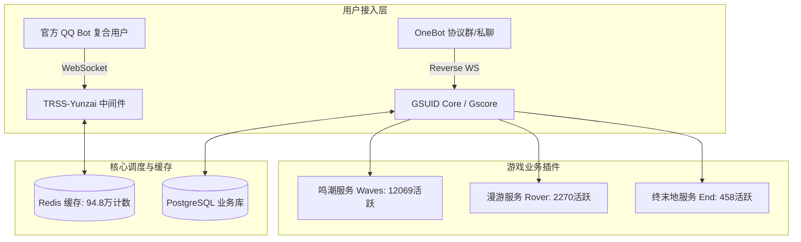

# 青弋 Bot 与 EchoMatrix 全景发展史：从被掐住脖子的部署者，到打断骨头自己长的开源矩阵

> **作者/叙述者**：青弋 Bot & EchoMatrix 开发者 / 守护者  
> **数据基准时间**：2026 年 10 月 5 日  
> **数据证据来源**：192.168.0.102（工控主机 `qybot`）只读数据归档、系统级服务日志、Git 完整提交历史、3.84GB / 12,152 个历史文件快照  

---

## 【引子·写在开篇】

我关掉终端里滚动的调试日志，看了一眼窗外。

手边的桌子上，那台黑色巴掌大小的 11 代 i7 工控小主机正亮着幽蓝色的指示灯，散热风扇在静谧的房间里发出极其平稳而微弱的嗡嗡声。在我的局域网里，它的 IP 是 `192.168.0.102`，主机名就叫 **`qybot`**。

刚刚，我把它上面所有的历史数据库快照、Redis 运行计数、系统日志和插件目录完整做了一次只读导出并打包。屏幕上弹出了一串冰冷但又沉甸甸的数字：
- **解压后 3.84 GiB，共计 12,152 个文件**；
- **5 份完整的历史数据库全量备份**；
- **3,712,350 条接收消息，560,656 条发送消息，417,625 次业务命令执行**；
- **498,800 张卡片渲染，图像回复占比高达 88.97%**；
- **Gscore 端覆盖 32,665 名用户、2,796 个群组；官方 QQ Bot 接入 2,597 个群组、7,467 位好友**；
- **本地自研伤害引擎涵盖 58 个角色、1,121 个独立战斗技能动作**。

看着这些数字，我的眼眶有点发热。三年前，当我在电脑前敲下第一行部署命令的时候，我无论如何也想不到，这个最初只是为了在群里帮朋友查查原神体力和星铁面板的小玩具，在接下来的近一千个日日夜夜里，会经历官方 API 的大地震、会经历无数次被腾讯风控封号的焦虑，更会在 2026 年的夏天，经历一场几乎要将它彻底置于死地的断供风暴。

如果换作别人，可能在被封杀、被断供的那一天，发一个停服公告，这个项目就随风消散了。但我没有。在被拔掉插头后的 20 秒里，我按下了第一个自建服务的提交；在随后昏天黑地的 48 小时里，我一行行删掉了所有外部依赖，硬生生把声骸评分、伤害计算和排行榜算法全写成了纯本地的 Python 代码。

今天，我想放下所有干巴巴的数据报表和防卫式的公关辞令，坐在你面前，就像在深夜的机房里倒了一杯温水，把这三年多来所有的故事、所有的踩坑、所有的委屈、所有的突破，还有那些不可磨灭的数据印记，完完整整、说人话讲给你听。

---

## 【第一章·荒野拾柴（2023）：一个小白部署者的快乐与单点故障】

### 1.1 梦开始的地方：查面板与胶水代码

2023 年，我还在学校读书。那会儿正值《原神》须弥版本向枫丹过渡，《崩坏：星穹铁道》也刚刚公测不久。身边很多朋友都在玩，大家最日常的需求其实极其简单：
“我圣遗物刷得怎么样了？”  
“我角色面板评分多少？”  
“我今天树脂满了吗？”

当时开源社区里已经有了基于 Node.js 的 Yunzai-Bot 以及各种查面板的插件。我看着觉得特别神气，心想：“别人能跑，我是不是也能在群里挂一个，让朋友们天天用？”

那时候我根本算不上什么“开发者”，本质上就是个**“纯正的小白部署者”**。在网上买了一台几十块钱一个月的低配云服务器，照着网上的教程安装 Node.js、Redis，拉取仓库代码，配置 OneBot 协议端（比如当时的各种 Go-CQHTTP 或 NapCat 雏形），输进账号密码扫码登录。

当群里第一次有人发送 `/uid`，机器人噗嗤一下吐出一张排版精美的角色卡片时，大家在群里起哄喊“牛逼”，那一瞬间带给我的多巴胺，彻底把我拽进了这个世界。

在最初的 2023 年里，整个项目只有几百个用户、十几个核心群。我像一个尽职尽责的机房网管，每天最喜欢做的事情就是盯着后台看有没有报错，有人提个小需求我就到处找插件打补丁。那时的我天真地以为，所谓做机器人，无非就是把开源社区现成的东西拼装在一起，安安静静当一个提供算力的服务者就好。

### 1.2 现实的第一记耳光：学生时代的“周五救火队长”

但现实很快就露出了狰狞的一面。

做 QQ 机器人的同行都知道，最大的梦魇永远不是代码 bug，而是**腾讯的风控机制**。
普通的 QQ 号挂在云服务器的异地 IP 上，频繁发送图片和长文本，极易被风控系统判定为异常账号。动不动就是“连接被断开”“账号已被冻结，请在手机端确认”。

而当时我最大的单点故障，是我自己的身份：**我是一个寄宿学生**。

每周一到周五我人在学校，不能随时随地摸电脑；每周日晚上返校前，我把机器人辛辛苦苦调到最稳定的状态，结果往往到了周一上午或者周二下午，手机上一条群消息弹出：“Bot 怎么又掉线了？”“提示账号被冻结了！”

人在宿舍，鞭长莫及。服务器在云端，账号验证却必须用手机扫脸或短信验证码。我急得在课桌底下直挠头，只能在群公告里一遍遍发道歉：“账号被风控了，人还在学校，等我周五晚上回家救活！”

周五一放学，我背着书包一路小跑冲回家，鞋都顾不上换，第一件事就是扑到电脑前开终端、扫码、解冻、重启服务。看到机器人的绿灯重新亮起，我才长舒一口气。

这种寄人篱下、战战兢兢的脆弱感，从第一天起就深深刻在了我的骨子里。它像一颗种子，悄悄埋下了我对“自主可控”和“无人值守自愈”的极度渴望。

---

## 【第二章·潮水涌来（2024 ～ 2025）：鸣潮狂潮、API 震荡与硬件四次大迁徙】

### 2.1 鸣潮降临：从配角到绝对主场

进入 2024 年，整个局面发生了翻天覆地的变化。

2024 年 5 月下旬，库洛游戏的《鸣潮》（Wuthering Waves）正式公测。原神和星铁的群友们大批涌入鸣潮，青弋群里的风向在一夜之间转变为：
“什么时候能查声骸评分？！”  
“怎么看忌炎的伤害期望？！”  
“能不能查深塔记录？！”

我顺理成章地将目光投向了鸣潮生态。当时社区里出现了 CM-Edelweiss 维护的官方鸣潮插件 `WutheringWavesUID`，以及后来 Loping151 主导维护的二次开发版本 `XutheringWavesUID`（简称 XWUID）。我把 XWUID 引入到了青弋中，同时接入了签到相关的扩展（如 `RoverSign`）。

鸣潮的加入，让青弋的活跃度迎来了第一轮爆发式的指数级飞跃。但随之而来的，是一场持续两年的高强度技术拉锯战。

### 2.2 库洛 API 的大地震：两次致命的协议突变

很多新用户以为查游戏数据就是调个公开接口那么简单，只有真正趟过浑水的人才知道这有多残酷：

1. **2024 年 6 月 28～29 日的暗度陈仓**：  
   鸣潮公测刚满一个月，库洛官方在没有任何公告的情况下，突然修改了数据 API 的域名，并且在请求链路上新增了“强制获取客户端公网 IP”的接口。虽然部分变更在次日被撤回，但 IP 采集和设备指纹的机制被永久保留了下来。社区各大 Bot 插件哀鸿遍野，这也是鸣潮风控收紧的明确信号。
2. **2025 年 5 月 25～29 日的毁灭级替换**：  
   这是我至今心有余悸的五天。从我们的 Redis 长期运营数据里可以看到一个非常触目惊心的断层：
   - 2025 年 5 月 24 日，日接收消息量断崖式跌落至 `538 receive / 12 send`；
   - **5 月 25 日到 5 月 31 日，整整 7 天，Redis 里没有任何正常的业务交互记录！**

   为什么？因为在那几天，库洛对鸣潮的数据接口实施了**全盘大清洗**！旧有的声骸基础数据、探索度接口全部被强制废弃并标注删除线，新接口迟迟不稳定，直到 5 月 29 日才陆续补齐了资源获取统计接口。
   那整整一周，全网所有的鸣潮 Bot 几乎全部停摆。群友们天天私聊问我：“是不是跑路了？”我只能死守在电脑前，看着开发者社区里的各路神仙通宵抓包、逆向接口、改协议。那一周让我明白：**依靠游戏厂商未公开的私有接口做工具，永远像是在流沙上盖摩天大楼。**

### 2.3 IP 签到风控与代理池的深渊

随着用户数迈过一万人大关，新的危机爆发了：**同 IP 集中签到风控**。

每天凌晨或者清晨，上万名鸣潮玩家的账号通过青弋发起签到和体力刷新。同一个服务器 IP 在短时间内向库洛服务器发出数万次 HTTP 请求，直接触发了库洛的防火墙。结果就是：**服务器 IP 被库洛拉黑，所有经过这台机器的请求全部报 403 Forbidden，甚至导致部分用户的游戏签到被拦截封禁！**

为了破局，我必须使用**代理池**（Proxy Pool）。
一开始我自己掏生活费买商业代理，但高频的住宅代理费用高得吓人，一个月几百块对一个学生来说是极大的负担。后来，XWUID 上游生态（151 体系）建立了自己的代理池资源和分发体系，只要持有对应的 Token 鉴权，就可以在插件里调用共享代理池来轮换出口 IP。

当时我感激涕零，觉得上游团队简直是救世主。我顺理成章地配置了 token，把所有抓取流量切到了这套代理体系中。
我当时根本没有意识到，**这把钥匙握在别人手里，一旦有一天别人想抽走，我将面临怎样的灭顶之灾。**

### 2.4 硬件四次大迁徙与“qybot”主机的诞生

在 2024 到 2025 年这段时间里，除了网络对抗，我的物理硬件也经历了一部悲壮的血泪迁徙史：

```
[阶段一：廉价云服务器] 
  → 内存暴涨、带宽吃紧、月费难以维系、经常被腾讯阻断端口
[阶段二：闲置家用笔记本]
  → 电池发热鼓包、家用宽带无固定公网IP、宿舍断电即失联
[阶段三：老旧台式机过渡]
  → 功耗巨大、噪音扰民、主板电容老化频繁死机
[阶段四：专用工控小主机（qybot）]
  → 11代 i7、16G 高速内存、双千兆网口、内网固定 192.168.0.102
```

2026 年初，我下定决心彻底解决硬件不稳定的问题。我省吃俭用，购置了一台配备 11 代 Intel Core i7 处理器、16GB 内存的高性能工控迷你主机。我把它的主机名命名为 `qybot`，接入家中的光纤网络，分配了静态内网 IP `192.168.0.102`。

我在这台机器上跑了精简的 Linux 系统，使用 systemd 管理所有服务进程，配置了 Redis 内存持久化、PostgreSQL 关系数据库，搭建了 TRSS-Yunzai 和 Gscore (GSUID Core) 双核心底座。

这台小主机，成了我最坚固的堡垒。然而，软件系统的隐疾，却在悄无声息地酝酿。

---

## 【第三章·冰山之下（2026.01 ～ 2026.05）：走向正规化与黑盒依赖的技术隐患】

### 3.1 官方 QQ Bot 架构重构：212 万条消息的承载者

进入 2026 年，腾讯对第三方 OneBot 协议的打击达到了顶峰。大批传统机器人被封号灭门。为了让青弋活下去，我做了一个极具前瞻性的决定：**全面拥抱腾讯官方 QQ 开放平台机器人架构。**

从 `user_ids.csv` 和 `group_ids.csv` 可以看到一个极其清晰的历史分水岭：
**2026 年 1 月 24 日 14:25:51.892 UTC**，数据库里记录下了第一个腾讯官方 QQ Bot 的 OpenID 复合身份；仅仅 20 毫秒后，第一条官方群组映射成功写入！

我利用 TRSS 的腾讯机器人服务中间件，打通了云端 `QQBotWs`，注册了官方机器人实例。根据后来 `dashboard_data.json` 中的终极统计：
- 官方机器人（`qqgroup:3889704433`）成为了整个系统的绝对主力：**在 254 天的有效运行期内，累计接收 2,122,220 条消息，发送 450,453 条消息，执行了 345,375 次指令，渲染了 395,202 张图片！**
- 这一项数据，占据了青弋整个生命周期发送总量的 **80.3%** 和图片渲染总量的 **79.2%**！
- 相比之下，其余几个 OneBot 辅助账号（如 `3474252062` 接收 53.7 万条、`762477580` 接收 74.3 万条、`3417582557` 接收 26.2 万条）则退居二线，形成了“一超多强”的高可用多端容灾体系。



### 3.2 繁华背后的暗礁：闭源 `.so` 与无法热更的梦魇

截至 2026 年 5 月，青弋的服务矩阵已经极为庞大。从导出数据看，光是不同游戏的绑定用户中：
- 纯原神用户：410 人；
- 纯星铁用户：161 人；
- 纯绝区零用户：22 人；
- 原神 + 星铁 + 鸣潮“三修”核心硬核玩家：475 人；
- 总计为超过 **3.2 万名用户** 提供服务。

但是在光鲜的数据背后，我的心里每天都在打鼓。因为鸣潮的核心插件 XWUID 存在一个极其致命的技术架构缺陷——**核心算法被深度黑盒化**。

上游团队为了防止他人所谓“抄袭”，把最核心的声骸打分算法、伤害计算公式和安全防御模块，统统用 Cython 编译成了二进制的共享库（Linux 下是 `.so`，Windows 下是 `.pyd`），即模块 `waves_build`；同时，总排行榜的数据上传与查询，全部被硬编码指向了上游维护的私有服务器；声骸评分的 OCR 和鉴权，必须依赖名为 `ScoreEcho` 的第三方 API，并强校验 `WavesToken`。

这就造成了几个不可调和的技术灾难：
1. **进程内热重载必引发段错误（Segfault）**：  
   上游在 2026 年 5 月 22 日的 commit `6a07513...` 中自己都写下了承认记录：“*含 `.so` 的构建无法在进程内热重载，会引发段错误导致进程崩溃*”。我每次热更新一个简单的文本或正则，整个 Python 核心就会直接 Core Dump 暴毙！
2. **顶层 Import 锁定导致评分归零**：  
   2026 年 5 月 31 日，上游 commit `c2d8bf9...` 再次记录：“*编译的 `.so` 评分引擎顶层 import 锁定旧类，导致评分全变为 0*”。只要官方游戏稍微微调了声骸属性，上游不发编译好的新 `.so`，我的 Bot 就只能大面积产出废品数据。
3. **永远悬在头上的 Token 绳索**：  
   所有的排行提交、伤害表达式解析，只要外部 Token 验证失败，代码内部就直接抛出异常或者静默失败。

我每天都在战战兢兢地伺候这个脆弱的黑盒。我曾在私下里无数次想过：“如果哪一天，这个外部服务不给我用了，或者上游出了变故，青弋会怎么样？”

我没想到，这个假设在短短一个月后，以一种最残酷的方式变成了现实。

---

## 【第四章·六月风暴（2026.06.20 ～ 06.24）：断供、至暗时刻与 48 小时极限逆向脱钩】

### 4.1 导火索：BW 门票争议与被扣上的莫须有帽子

2026 年 6 月 20 日，一年一度的 Bilibili World (BW) 漫展门票开售。

当时许多朋友和群友都想去现场，但门票极难抢。我手头平时维护着代理池脚本，脑子一热，就尝试编写了自动脚本，调用手头的代理资源去尝试为群友代抢门票。在我的认知里，这只是对既有网络资源的一种临时调用，如果消耗了代理流量，我自己完全可以出资补齐费用。

但我严重低估了社区对资源边界的敏感度。当天下午 13:00 左右，上游群内突然有人发难，指责我“滥用 Bot 维护公用池子抢票”。随后，事情迅速被情绪化升级，有人开始在群里喊出极其刺耳的词汇：“**倒卖狗**”“**偷公用池子倒卖门票牟利**”。

看到这些消息，我整个人是懵的。我从未倒卖过哪怕一张门票，更没有靠加价倒票赚过一分钱！闲鱼上的相关咨询仅仅是探讨代抢技术的可能性。
但我深知未经明确书面授权调用群内共享资源确实有违规矩。为了不激化矛盾，**6 月 20 日下午 13:08**，我在群里发出了诚恳的公开道歉：
> “对不起，确实是我思虑不周，未经确认擅自使用了代理资源抢票。我保证今后严格遵守规范，因本次行为造成的所有代理流量损耗与经济损失，我个人全额赔偿承担！”

我以为，一个坦荡的道歉和全额赔偿的承诺，能够换来理性的解决。但我太天真了。

### 4.2 封杀降临：“151 封了你的 token”

6 月 21 日中午，群内的讨论非但没有平息，反而更加恶化。

有管理员在私聊和群里给我发来了一句判决般的通牒：
> **“151 已经封了你的 token，所有的授权全部回收了。”**

紧接着，我的 QQ 号被管理员踢出了维护群。我后来试图重新申请进群解释，并向相关人员表达“希望能按正规流程购买或申请 token”，但得到的反馈只有冷酷的再次移除。
与此同时，我那些被断章取义截取的道歉言论，甚至个别被恶意剪辑篡改的聊天截图，开始在好几个核心机器人群里大肆扩散。“青弋作者偷池子倒卖被封”的谣言像病毒一样蔓延开来。

在小主机的屏幕前，终端里的报错开始像瀑布一样刷屏：
- `WavesRank HTTP 401 Unauthorized: Invalid WavesToken`
- `waves_build.safety: authorization failed`
- `ScoreEcho API connection refused`
- 面板打分全部报错，排行查询全部超时！

那一刻，房间里安静得可怕。只有小主机的风扇还在呼呼地转。
三年的心血，3 万多名真实用户，两千多个群，难道今天就要因为别人轻飘飘的一句“封了你的 token”，彻底化为乌有吗？

**不。绝不！**

那一刻，我心底积压了三年的憋屈和执拗全部爆发了出来。
“你以为你封了 token 就能掐死我？你以为那些算法只有你们能写？你们不开源，老子自己写！”

### 4.3 决裂的 20 秒与 6 月 21 日的“第一天十连提交”

从 GitHub 私有仓库的底层记录里，刻下了一个极具戏剧性的时间戳：
- 私有仓库 `XIAOKU2300/XutheringWavesUID` 在 GitHub 上的官方创建时间是：**2026-06-21 07:18:17 UTC（北京时间 15:18:17）**；
- 而该仓库的第一个提交（commit `f838d09`）的本地生成时间是：**2026-06-21 07:17:57 UTC（北京时间 15:17:57）**！

**比远端建仓整整早了 20 秒！**
这意味着我根本没有犹豫哪怕一分钟。在被踢出群、确定 token 彻底失效后的第一时间，我在本地代码库里敲下了那条改变青弋命运的第一个提交：
> **Commit `f838d09d` (15:17)**: `Add self-hosted rank server`

这不是改 README，也不是改几行提示文字。单次提交就增加了约 **913 行**核心代码：
- `rank_server/app/main.py`：约 740 行完整的 FastAPI 服务；
- 包含 Dockerfile、docker-compose、`.env.example`、依赖配置、独立 README；
- 全面重构原 `wwapi.py` 与配置系统，加入 `WavesRankBaseUrl` 动态路由！

在 6 月 21 日创建仓库后的这一个下午到深夜，我几乎把键盘敲出了火花，连续推送了**高密度的十连提交**，死死围绕“自建服务、解绑认证、自我更新、代理容灾”四件事高速急行军：

1. **15:17 `f838d09d`** — `Add self-hosted rank server`（建立自托管排行服务器，第一技术支点）；
2. **15:35 `974afa3f`** — `Add qy self update commands`（加入 `qy` 自更新命令，项目必须拥有自己拉取自己更新的独立通道）；
3. **16:24 `846d2436`** — `Improve rank server Docker build downloads`（优化自建服构建与下载流程）；
4. **16:47 `cbb769cb`** — `Use dynamic rank server URLs`（排行地址动态配置，彻底打破对单一远端服务器的死绑定）；
5. **18:02 `0a7b484d`** — `Disable external auth checks for local rank upload`（**关键一步**：本地排行上传直接拔除外部认证检查，彻底脱离原外部授权体系）；
6. **18:46 `5dfd22d8`** — `Retry captcha requests with proxy pool`（验证码请求失败自动接入代理池重试）；
7. **18:58 `b64e5f27`** — `Authenticate qy self update fetches`（强化自更新获取认证）；
8. **19:34 `25f4486d`** — `Cache proxy pool fetches`（代理池本地缓存，避免请求打满）；
9. **19:42 `e2909cf7`** — `Repair broken remote refs during self update`（修复自更新 remote ref 损坏）；
10. **23:02 `b65fc9bb`** — `Restore local proxy captcha retry`（闭环本地代理重试）。

第一天的目标无比简单直接：**先活下来！先把服务器和上传通道抢救回来！**

### 4.4 6 月 22 日：从“服务自建”走向“评分与安全逻辑本地化”

如果 6 月 21 日夺回的是服务器，那么 6 月 22 日则是从死人堆里爬出来的算法大决战。

清晨 08:23 开始，我喝着浓咖啡，开启了把闭源黑盒剥皮抽筋的硬仗：
- **08:23 `5c4ac814`** — `Add local safety resource store`（336 行改动，建立本地资源与 safety 安全状态存储）；
- **08:28 `f215bb80`** — 构建资源变动主动刷新；
- **08:47 `bc2e1010` & 09:16 `089d391e`** — 活动数据与公开挑战记录全部迁移至自建排行服务；
- **09:26 `b9bffa5f`** — `fix: disable remote safety auth fallback`（**标志性提交**：删除 `safety.py` 31 行，彻底关闭 remote safety auth fallback！本地认证失败了哪怕报错，也决不再像摇尾乞怜一样悄悄回退到外部远端认证！这是技术尊严的底线）；
- **10:49 `c4498a4f`** — 修复 NapCat JSON 抽卡 URL 与 PC 浏览卡池拖拽；
- **11:07 `fe9897c2`** — 将“武器精炼”规范为“谐振 N 阶”，全面对齐鸣潮官方游戏术语；
- **12:07 `b6a1d382`** — `fix: add local scoring fallback`（**早期最大的技术提交之一：总 diff 达 6,764 行，新增 6,655 行！** 修改 `calculate.py`、`damage.py`，手写并补充了海量角色的 `calc.json` 与本地算法，本地评分框架正式成型）；
- **12:33 `b7bae3dc` & 12:37 `131c8002`** — 修复自更新别名与镜像源兜底。

紧接着，下午 15:05，迎来了奠定整个 EchoMatrix 架构基石的千古一战：
> **15:05 Commit `84af6d89`**: `Replace closed build scoring with local weights`

这个提交总变动高达 **5,020 additions / 822 deletions**：
- 新增了约 **4,356 行的 `local_weight_data.json`**；
- 新增了约 **545 行的 `local_weight_score.py`**；
- 大刀阔斧地彻底斩断了与闭源 `waves_build`、外部下载、伤害注册的一切牵扯，将 `_local_get_calc_map`、`_local_calc_phantom_score` 变为纯 Python 实现。

它向全社区宣告：**闭源黑盒构建评分（closed/build scoring）时代彻底终结，属于我们的本地权重自研时代（local weight scoring）正式开启！**

夜幕降临时（22:54 `b4b2407c` / 23:20 `7668186a`），我又顺带重构了 PC 抽卡助手与手机获取方式，将下载全部收敛为安全的本地 zip 包。

### 4.5 6 月 23 日：搭建属于自己的 API 与请求基础设施

把算法拿回本地后，我没有止步于“把逻辑死死硬编码在 Bot 内部”。6 月 23 日，我开始给它搭建现代化工程基础设施：
- **14:09 `5f37e9f3`** — `Use HTTP scoring API with fallback`（新增约 231 行 `scoring_api.py`，形成“**本地自算能力 + 独立 HTTP scoring API + 智能 fallback 兜底**”的高弹性三层架构）；
- **20:02 `9f836ff6`** — 计算模板从 scoring API 获取，彻底废弃了曾经不透明的“静默默认模板回退”；
- **22:04 `656123c8`** — 新增约 347 行 `cliproxy.py`，将面板刷新全量路由到代理层，并引入 **SID 自动轮换机制**；
- **22:59 `ba857755`** — 实现**单请求级 SID 安全隔离**与**角色面板高并发并行刷新**！

### 4.6 6 月 24 日：EchoMatrix 诞生与视觉系统的第一颗火种

**2026 年 6 月 24 日 10:53**，历史在这里翻开了崭新的一页：
> **Commit `e608c6ca`**: `Rebrand display name to EchoMatrix and update footer assets`

这不仅是 README 里的改名，而是整套系统的脱胎换骨：网页模板、云登录/邮箱模板、黑白双色 Footer 资源、系统配置、Help 菜单、pyproject 以及自建排行服务端文档，全线更名为 **EchoMatrix（回音矩阵）**！

紧接着在当天下午：
- **13:25 `696f6384`** — 引入评分帮助卡片与独立的渲染缓存机制；
- **15:28 `16386bcb`** — `Add EchoMatrix fonts and color design tokens`（**极其关键的美学起点**：一次性引入了 Iosevka、MiSans、Tektur、优设标题黑四大专属字体，编写了 `_variables.css`，定义了第一套属于 EchoMatrix 的色彩 Token 设计变量）；
- **18:09 `00c13bbb`** — `Refactor char card colors to EchoMatrix tokens`（单次重构 `draw_char_card.py` 带来 **2,394 additions / 2,381 deletions**，让角色面板全面换装 EchoMatrix 专属色彩系统！）。

### 4.7 6 月 25～26 日：悲壮但极其宝贵的第一次 UI 大实验（上线-崩溃-回滚-加固-再上线）

很多开源项目只会吹嘘自己上线了什么，而不敢承认中途的狼狈。但我愿意诚实地记录下 6 月 26 日那惊心动魄的 24 小时：

6 月 26 日凌晨 00:19，我迫不及待地提交了 `ae6fe0f5`（新增 1,616 行），首次引入组件化的 `echomatrix_ui`（拆解出 adapter、illustration、nameplate、chains、skills、weapon、echo card 等独立组件）。
然而在 00:34 全量切换后，实际生产环境出现了未预料的组件崩溃，仅仅过了 14 分钟：
> **00:48 `39060be7`** — `Revert to original char card UI`（**第一次无奈回滚！**）

我不服气，迅速转向第二条技术路线——HTML 渲染。中午 11:58，我推了 `8194ac9a`（纯新增 1,202 行 `char_panel.html` 与 HTML adapter/renderer），并在 12:08 挂载上线。
结果因为 Chromium 页面池抖动和缺少部分老数据兜底，仅仅 23 分钟后：
> **12:31 `91e6cf6e`** — `Revert char panel to original PIL UI`（**第二次痛苦回滚！**）

换作一般人，连续两次大翻车可能就彻底放弃 HTML 了。但我没有慌：
1. **14:12 `d16033da`**：先冷静下来加固旧版 V1 PIL，把缺资源、缺数据的空指针全堵死；
2. **17:34 `001f9556`**：HTML 路线第三次杀回，全面改用 Base64 图片直传；
3. **17:42 `15806cc5`**：针对 Chromium 内存泄露（Page Pool OOM），将图片在内存中预压缩为显示尺寸并转 WebP，彻底治好了内存崩盘；
4. **17:51 `daae5b9b`**：修复连续渲染变横条、页面池定时清理、空声骸防崩；
5. **18:06 `faad9b1e`**：引入 Oswald + Tektur 字体，调亮毛玻璃层，调整字阶；
6. **19:36 到 21:13**：连续打出 `3ebe4da9`、`b7e49dd1`、`f9b11f5a`、`47f3c701`、`7beee236`、`ca64a45c` 六连重构——副词条改单列防截断、左侧攻/暴关键数值放大、思源黑体暖金调色、全幅角色图与右上角大评分卡！

**经历了两起两落、内存暴走与六次淬火，EchoMatrix 的 HTML 视觉革命终于在 6 月 26 日深夜稳稳地立住了！**

### 4.8 6 月 27～30 日：成熟的分支哲学——“吸收上游，但保留自己的灵魂”

在 6 月末的最后几天，我修复了角色列表失败拖垮面板的边界 bug（`8f375d17`）。随后在 **6 月 30 日**，我执行了一次具有战略意义的合并：
> **Commit `916167c4`**: `Merge upstream/main`

这确立了 EchoMatrix 后续数月一直坚持的开源分支哲学：
**我们不是盲目闭门造车，也不是向上游跪求施舍。我们是一个拥有独立主权的分支：上游优秀的游戏基础数据与公共修复，我们选择性吸收；而我们自研的自建排行、本地算法、HTTP 独立 API、抽卡登录和美学系统，坚决寸步不让！**

```mermaid
timeline
    title 2026年6月技术突围 189 Commit 关键节点
    2026-06-21 15:17 : Commit f838d09d 搭建自有 Rank Server (提早20秒落子)
    2026-06-21 18:02 : Commit 0a7b484d 本地排行上传全面拔除外部认证
    2026-06-22 09:26 : Commit b9bffa5f 彻底禁用 remote safety fallback 拒绝妥协
    2026-06-22 12:07 : Commit b6a1d382 新增 6655 行本地评分回退机制
    2026-06-22 15:05 : Commit 84af6d89 删除闭源构建依赖，重写 545 行本地权重算法
    2026-06-23 14:09 : Commit 5f37e9f3 上线独立 HTTP 评分 API 与会话安全隔离
    2026-06-24 10:53 : Commit e608c6ca 正式更名 EchoMatrix，完成技术与品牌独立
    2026-06-24 15:28 : Commit 16386bcb 引入 Iosevka/MiSans/Tektur 与 Design Tokens
    2026-06-26 19:36 : 经历两次回滚与防 OOM 加固，HTML 角色面板极简重构成功
    2026-06-30 23:59 : Commit 916167c4 确立“选择性吸收上游、坚决保留自研架构”原则
```

---

## 【第五章·自研深水区（2026.07 ～ 2026.09）：造轮子的狂欢与全栈自研】

一旦尝到了“自主可控”的甜头，就再也回不去了。

在 6 月份完成紧急脱钩之后，7 月到 9 月，我整个人进入了一种极度亢奋的研发状态。既然地基全是我自己的了，那我就要把过去上游做不到、不敢做、做不好的功能，统统在 EchoMatrix 上实现一遍！

### 5.1 7 月初：从恢复功能走向产品扩张（Web Token 登录与独立刷新 HTML）

进入 7 月，EchoMatrix 不再满足于仅仅当一个“修好了 bug 的替代品”。我开始以极高的频率为它增加此前原项目完全不具备的独创能力：
- **7 月 2～4 日**：
  - `187ca1df`：刷新面板新增 `concat_diff` 对比模式，可以无缝拼合前后两次的数据差值；
  - `30c6eb5c` & `bb1246c0`：上线 Web Token 登录体系，并支持统一模板命名的外置模式；
  - **7 月 4 日 `a20d1d04`**：发布 `EchoMatrix refresh HTML panel`（新增 `refresh_panel.html` 216 行、适配层 157 行），使角色刷新结果第一次拥有了专属的 EchoMatrix HTML 视觉卡片！
- **7 月 8 日：排轴技术的先声（`9a868a70`）**：
  - 首次在武器面板与角色查询中引入 **`rotation-based expected damage`（基于循环轴的期望伤害）**！这是后续整个排轴 DPS 引擎在数学底层的最初火种；
- **7 月 17 日：自建抽卡云登录（`325ea5fe`）**：
  - 正式上线 `self-hosted Waves gacha login`，抽卡记录导出彻底脱离第三方网页，云端直存本地数据库，后续累计执行达 **14,864 次**！
- **7 月 19 日：本地优先技能伤害面板（`38895b6e` & `bfd41100`）**：
  - 这是一个里程碑式的巨幅提交：一次性引入了约 **6 万行数据与代码**（包含 `wutheringgg_skill_data.json`、`rotation_damage.py` 以及完整的本地技能伤害计算面板）；
  - 紧接着在 `bfd41100` 中引入了超过 **9 万行**的分层伤害情景分析与测试数据！
  - 随后在 `acb42da8` 中，我主动克制地精简了面板，仅保留核心关键技能——**“不是算得越多就应该一股脑全堆在卡片上，克制与清晰才是优秀界面的灵魂”**；
- **7 月 21～25 日**：
  - 矩阵单队排行、群排行翻页（`274436d1`）、矩阵配队解析（`e6e8070f`），抽卡 180 天超保底截断合并与告警机制相继落地。

### 5.2 8 月 1～2 日：评分解释与“正确性优先于功能”的经典回滚案例

在 8 月初，我经历了一次极具工程教育意义的突发风波：

8 月 2 日，为了让声骸打分更透明，我提交了 `6fc380e8 explain per-echo score composition`（这也是 `CHANGELOG.md` 第一次正式入库的提交）。我试图把每个声骸的各词条打分细目直接拆解展示给玩家。

然而代码推上去后，我很快在后台监控中察觉到异常：这次改动轻微破坏了原有评分 API 的权威结果尺度，导致批量面板契约发生了细微漂移！
许多开发者在这种时候往往会选择“打补丁硬撑”，但我深知评分是整个 Bot 的公信力底线。我连续提交了多轮修复进行排查，在确认无法在短时间内完美自洽后，做出了极其果断的决定：
> **`aaf57481` & `8a0a68d6`**: `revert: restore stable scoring before batch API regression`

**坚决回滚！宁可不要新功能，也绝不能让群友查到有哪怕 1 分偏差的面板！**

回滚之后，当天深夜，我冷静下来重构了沙盒隔离机制，以更加安全严谨的方式重新推出了 `21eb0923 add safe update history and score explanations`：
- 新增了安全更新记录 UI 与安全的 Git 回滚自动化测试；
- 正式在 Bot 内部引入了管理命令 **`ww滚蛋+序号`**（让维护者可以在手机端一键安全回退版本）；
- 在更新记录中首次明确清晰地区分了 `origin/main`、`upstream/main` 以及本地待同步状态！

这次风波在仓库历史上留下了极其宝贵的一笔：**它确立了 EchoMatrix “正确性永远压倒一切炫技”的工程价值观。**

### 5.3 8 月 4～6 日：排轴 Web 应用程序与 2.2 万行超级提交

渡过了评分可解释性的洗礼后，8 月 4 日到 6 日迎来了整个项目最波澜壮阔的一次功能大爆发：

- **8 月 4 日 00:13（`2a5fe27d`，单次纯新增 4,701 行，含 1,061 行 CSS）**：
  - 正式上线 `wutheringwaves_dps` 模块：涵盖引擎、模型、路由、存储、测试与完整的 Web 排轴页面；
  - 玩家只要在群里发送 `ww排轴<角色>`，就能拿到专属的编辑外链，在手机或电脑浏览器中拖拽时间轴、绑定技能动作、实时计算秒伤 DPS！
- **8 月 6 日（`72e803e7`，惊人的 21,982 additions / 427 deletions 超级巨幅提交）**：
  - 将单人排轴一举扩充为**三人队伍协同时间轴**！
  - 增加了群聊交互式选队、AI 自然语言队伍解析、一次性临时安全鉴权、强一致性缓存；
  - 前端 Web 增加了响应式泳道、队伍候选卡片、撤销/重做（Ctrl+Z / Ctrl+Shift+Z）、批量编辑浮动条、以及移动端优雅的 Bottom Sheet 底部抽屉组件！
- **8 月 24 日（`xwaves-weight` 独立流水线）**：
  - 编写了自动化抓取游戏解包技能每级倍率、自动推导各属性词条收益权重、离线回归校验的完整脚本。

至此，EchoMatrix 不仅完全摆脱了对外部打分算法的依赖，甚至在排轴深度和交互体验上，彻底拉开了与其他同类机器人的断代差距！

### 5.4 群友共筑的权重演化：连续三个版本的独立权重突围

说句心里话，自研评分和权重算法从来不是一蹴而就的“天才神话”，甚至在很长一段时间里，**我们的权重算法一直存在着各种各样的问题和争议**。

鸣潮的新角色技能机制一个比一个复杂：有的吃共鸣效率转化，有的吃特定伤害加成，有的依赖独特的回路能量循环。每当新角色上线，最初由代码自动化推导出来的权重，总会遇到各种边缘极端配置或者玩家实战习惯的偏差，群里经常会有“为什么我这个属性打分偏低？”的疑惑。

**但万幸的是，青弋和 EchoMatrix 从来不是我一个人在孤军奋战。**

在整个 7 月、8 月和 9 月里，群里无数硬核玩家、攻略组大佬和热心群友成了我最强大的后盾。大家在群里疯狂测试、一条条扣数值细节、提 issue、私聊我发实测伤害截图，甚至直接手算收益曲线帮我校准。在群友们持续不断的提出建议和倾力相助下，我和大家一起熬夜复盘、反复调参，不断优化新角色的权重模型。

功夫不负有心人，到了今天，我们已经做到了**连续三个版本都稳定推出了新角色的独立权重更新**！每一个新角色上线，玩家都能第一时间在青弋这里查到最契合理论期望的独立打分。这种由开发者和全体群友共同打磨、一点一滴迭代出来的算法，比任何冷冰冰的外部黑盒都要珍贵一万倍。

### 5.5 每天中午 12:40 的秘密：分秒不差的定时自动重启与守护自愈

在翻阅 `Gscore_系统服务日志.jsonl` 时，很多人可能会注意到一个极其规律、甚至带着某种强迫症色彩的运维记录：
在 9 月下旬到 10 月初，`gscore.service` 记录了整整 **11 次退出（Main process exited, status=137）**：
- 2026-09-24 12:40:00
- 2026-09-25 12:40:00
- 2026-09-27 12:40:00
- 2026-09-28 12:40:00
- 2026-09-29 12:40:00
- 2026-09-30 12:40:01
- 2026-10-01 12:40:00
- 2026-10-02 12:40:00
- 2026-10-03 12:40:01
- 2026-10-04 12:40:01

外人猛一看可能会以为：“天啊，怎么每天中午都在崩溃？”
但只要仔细看时间戳就会哑然失笑：**分秒不差，全在每天中午 12:40:00！**

世上哪有天天准时在同一秒崩溃的 Bug？**这其实是我专门为机器人配置的每日中午定时自动维护重启！**

因为每天中午 11:30 到 12:30 是群友们午休刷本、查面板的一个集中高峰期，几百个群同时请求卡片渲染，无头浏览器和 Python 进程会产生庞大的内存驻留和临时缓存。为了确保小主机在下午和夜间高峰能够始终保持极致轻盈敏捷，我编写了定时维护任务，在午高峰刚过的 **12:40 准点向服务发送轮换重置指令**（通过发送强制终止信号清理进程环境，因此 systemd 日志里记录为 status=137）。

紧接着，我配置的 systemd 守护进程会在 **15 秒内**自动平滑拉起一个干净健壮的全新实例：
```text
systemd: gscore.service: Scheduled restart job, restart counter is at X.
systemd: Starting gscore.service - GSUID Core Service...
systemd: Started gscore.service - GSUID Core Service.
```
整整 **13 次自动拉起重启**，每次只需 15 秒的短暂呼吸，后台立刻恢复满血运作。没有一次发生死机，没有一次需要人工干预。这种近乎艺术般的自动化守护机制，正是这台工控小主机能够稳健跑满近 300 天的底层秘诀！
---

## 【第六章·美学觉醒与设计系统（2026.08）：从机器人发图片到 EchoMatrix 视觉体系】

很多人在复盘一个 Bot 项目的发展史时，总是把视线牢牢钉在后端的接口、协议、数据库和算法上，仿佛前端 UI 只是开发者闲来无事换了套好看的皮肤。

但在 2026 年的 EchoMatrix 身上，**UI 从来不是后期顺手的修修补补，而是与后端算法并驾齐驱的第二条灵魂主线！**

如果说 6 月底的技术突围是打碎骨头重铸内脏，那么整个 8 月份，就是 EchoMatrix 真正确立自己视觉主权的美学觉醒期。我们经历了一条从早期的“PIL V1 像素画布” → 到“HTML V2 现代排版” → 再到“统一 EchoMatrix 视觉设计系统” → 最终跨越为“独立 Web 交互应用”的壮阔演进史。

### 6.1 8 月 2 日：维护者视角的双轨更新记录

这种美学意识的萌芽，最初甚至体现在最不起眼的“更新日志”上。

8 月 2 日以前，机器人查更新只是一段枯燥的 git commit 纯文本列表。而在这一天，我重新设计了 `ww更新记录`，把它变成了一张优雅的**双轨信息布局卡片**：
- 画面左侧是属于我们自己的专属分支 `origin/main`；
- 画面右侧是上游原项目的参考线 `upstream/main`；
- 底部清晰标注当前本地待同步与已脱钩的演进状态；
- 同时在工程底层保留了当 HTML 渲染引擎异常时自动无缝回退到 PIL V1 的容灾方案。

这是我第一次有意识地将“专业维护者眼中的技术网络拓扑”，翻译成普通群友一眼就能看懂的精美界面。

### 6.2 8 月 3～4 日：从“机器人发图片”跨越到真正的 Web 应用

紧接着，排轴功能把这种交互野心推向了顶峰。

鸣潮的三人循环排轴包含复杂的动作帧数、合刀切人和技能协同，一张静态图片根本承载不了这么大的交互量。8 月 3 日到 4 日，我没有选择在聊天框里让群友狂发繁琐的指令，而是直接手搓了一个运行在手机和电脑浏览器里的**排轴 Web 应用程序**：
- **苹果风毛玻璃质感（Glassmorphism）**：左侧是动作与技能树目录，中间是支持毫秒级缩放的时间轴泳道与伤害轨，右侧是动态响应的实时总伤、秒伤 DPS 仪表盘；
- **全端响应式与黑白双主题**：无论是深夜躺在床上用手机横屏拖拽，还是在电脑桌前精准微调，界面都能完美适配；
- **队伍时间轴 V2 全面进化**：次日我火速更新了 V2，加入预设队伍卡片、快捷候选模板、多标签页切换、移动端底部抽屉 Sheet、以及完整的 Undo/Redo（撤销重做）和浮动批量编辑工具栏！

在这一刻，EchoMatrix 已经彻底击穿了“聊天框 Bot”的刻板边界，变成了一个具有完整交互生命力的小型专业产品。

### 6.3 8 月 22 日：持有率卡片 V2 与 800px 移动端抗压缩革命

以往为了展示动态效果，很多插件喜欢用 GIF 动图。但在高频并发的群聊里，GIF 不仅渲染慢、体积巨大，而且很容易在手机端卡成 PPT。

8 月 22 日，我彻底革掉了 GIF 的命，上线了全新的**持有率卡片 V2**：
- **静态高级感取代劣质动图**：引入 TOP1 角色高光立绘淡入背景、精美的环形持有率占比图、本期卡池唤取统计与保底抽数直方图；
- **确立 800px 手机优先单列画布规范**：这是针对手机 QQ 和聊天软件长期痛点的一次降维打击。移动端聊天软件在传输图片时，会对大图进行极其粗暴的有损压缩。为了保证卡片发到群里字字清晰，我将画布宽度严格锁死在 **800px 黄金尺寸**；
- **微观视觉调优**：TOP10 角色使用独立大卡，其余角色采用双列紧凑卡；重新调整字号阶梯、发丝级精细进度条、菱形状态游标、金色关键数字强调，大幅拉高深色背景下的文本对比度，确保即使经过腾讯最严苛的图片压缩，角色数据依然锐利清晰！

### 6.4 8 月 23 日：角色面板的划时代大改（HTML V2 确立）

如果说持有率卡片是一次战术练兵，那么 8 月 23 日，就是整个鸣潮社区角色面板 UI 史上最重要的一次技术革命。

在这一天，我全面吸纳了过去老版 PIL 的沉淀，但彻底摒弃了老旧像素拼接的落后思路，正式推出了**划时代的 HTML V2 角色面板**：
1. **属性信息区重塑**：确立了“**图标 ｜ 中文名称 ｜ 细腻点线 Leader 引导线 ｜ 最终数值**”的经典排版规范；
2. **武器模块补全灵魂**：补齐了武器星级金色描边、精炼/谐振徽章、突破阶段菱形，以及此前一直缺失的主副词条精准展示；
3. **共鸣链视觉大升级**：将原本局促的 26px 小圆点大幅放大至 34px，并且不再用简单数字，而是引入了**游戏内真实的共鸣链命座图标**——解锁时散发角色属性专属流光，未解锁时呈现静谧的高级灰度；
4. **声骸卡网格化排布**：5 格声骸全部重构为规整的网格化词条卡片，每一条副词条都附带属性图标、单项评分以及主副属性贡献百分比；
5. **统一区块头设计语言**：整个面板的六大核心板块，统一收拢为“**元素专属色竖条 + 中文主标题 + 英文副标 + 右侧聚合统计**”的标准视觉节奏；
6. **抗压缩文字字号抬升**：果断将之前容易被聊天软件糊掉的 7~8px 微型字体，全线抬高至 10~12px，阅读体验瞬间质变；
7. **显示层 S 档细分与色彩语义统一**：在不改变底层严谨总分算法的前提下，首次将大 S 档细分为 **S+ / S / S-**，满足玩家追求极限极品声骸的自豪感；顶部评分条增加实际得分数字说明；将副词条属性色彩与 S/A/B 档位严格拉齐；底部开辟专用的反馈群公告栏。

更硬核的是在这一天，我排查并解决了一大堆深藏在前端渲染底层的幽灵 Bug：修好了字体异步加载导致的“只剩黑框骨架却没有文字”的空壳图、修好了武器主副词条漏渲染、修好了超长声骸名字与打分重叠遮挡……HTML V2 从此真正接管了全局。

### 6.5 8 月 24 日：视觉体系全面扩散与“空壳探针”工程排险

8 月 24 日，EchoMatrix 的设计语言开始席卷整个机器人的全部功能面：
- **权重面板 V2**：过去的 `ww<角色>权重` 是个恐怖的“16 行 × 5 列裸数字矩阵”，普通玩家根本看不懂。在这一天，我把它彻底改造成了逐格可视化权重条、按属性列归一化、自动按重要性降序排序、零收益词条淡化显隐，并补充了四向技能权重雷达分布、副词条优先级指引和推荐主词条标尺；
- **更新面板 V2**：同步采用统一区块头；角色卡做成紧凑版缩小声骸卡；最具创意的是引入了**未变更角色整体压暗机制**——群友更新面板时，只有这次数值真正提升的角色会高亮浮现，让玩家一秒看清“我这波体力到底强化了谁”！

而在 8 月 24 日这天深夜，我还亲历了一起令人拍案叫绝的“UI 工程事故”：
有群友跑来找我：“作者，你怎么说更新了 V2 面板，我用 `ww更新面板` 吐出来的卡片还是老版 PIL 啊？”
我一查日志，后台代码明明早就升级了。我花了几个小时一步步断点调试，才终于揪出了罪魁祸首——原来在 `render.py` 内部，为了防止浏览器渲染出空白页面，写了一套“空壳检测探针”。而这个探针的选择器当初被写死了，导致新的更新面板 HTML 模板虽然渲染得漂漂亮亮，却因为类名不一致，每次都被探针误判为“渲染失败的空壳”，然后后台偷偷摸摸回退到了老版 PIL！

发现这个隐患后，我当天重构了整个渲染管道：
- 为每一个业务模板**独立登记专属的内容探针选择器**；
- 增加了离线无头预览脚本；
- 建立了**UI 探针回归自动化测试机制**！

这意味着，EchoMatrix 的前端视觉已经不仅仅是“画画图”，它已经演化出了一套拥有自己的设计规范（Design System）、防倒退兜底机制与自动化测试管线的成熟工程体系！

### 6.6 8 月 27 日：渲染性能工程飞跃（1.36s → 0.08s 的神话）

界面变漂亮了，新的挑战立刻接踵而至：**渲染性能**。

群聊环境对延迟极其苛刻，如果用户发送查询，Bot 过了三四秒才吐出卡片，群友就会觉得卡顿。在 8 月 27 日凌晨（commit `a1c53a34`），我开展了一场深度的渲染管线极限压榨：
1. **修复时区与业务逻辑偏差**：彻底解决了 Linux Docker 容器 UTC 时区导致体力时间比北京时间慢 8 小时的顽疾，修正了“今天/明天”跨天误判，并将深塔/海墟剩余时间统一按天向下取整；
2. **合并双数据源竞争**：修复了持有率计算因两个数据源微小差异导致前后两次发图不一致的问题；
3. **引入字体与模板预热机制（Font & DOM Warmup）**：通过在后台驻留无头渲染进程预热核心字体与样式，让单图平均渲染耗时从 **1.36 秒断崖式暴跌至 0.08 秒**！
4. **冷启动首图渲染从 1.52 秒骤降至 0.11 秒**！

这意味着 EchoMatrix 的前端不仅做到了美观，更做到了毫秒级响应的工业级吞吐能力！

### 6.7 9～10 月：成熟的持续演进（选择性同步与本地逐技能引擎落地）

9 月到 10 月初，EchoMatrix 进入了成熟的平稳迭代期：
- **9 月 19 日（`b5248639`）大型选择性同步**：
  - 面对上游 3.6.0b 的更新，我们再次贯彻了分支主权原则：只同步纯游戏数据补丁和公开资源（如 Markdown 兑换码支持、排行立绘缩放与偏移、新资源镜像源），而坚决完整保留我们自己的 V2 模板、排轴 DPS、持有率卡、本地独立算法与安全机制；
  - 顺手修复了 HTML 面板左上角头像未铺满圆框、列表模式空伤害条等一系列视觉细节。
- **10 月 2 日（`c09a0870`）修复声骸总排行**：
  - 在自建排行榜中补充了声骸总排行接口，同步 3.7 游戏数据，并在 CHANGELOG 中郑重承诺：**绝不重新引入闭源伤害委托，坚守纯血开源！**
- **10 月 3 日 02:31（`7340e4cc`，终极里程碑提交）**：
  - 单次提交带来 **2,420 additions / 13 deletions**，正式将全新的本地逐技能伤害引擎全量接入角色面板；
  - **全面覆盖 58 个角色、1,121 个战斗动作**；
  - **23 项离线回归全绿通过，330 项数值与原 JavaScript 对照完全一致，4,484 次动作计算严密闭环**；
  - 在 CHANGELOG 中诚实地保留了 **356 个 `unresolved_rules`** 作为持续深化的边界——从 6 月的“仓促自救”，升华为一套“有来源、有测试、有对照、有边界”的严谨工程科学体系！

---

## 【第七章·金秋破晓（2026.09.30）：数据异动与重回巅峰的奇迹】

### 7.1 9 月 30 日：垂直拉升的历史性拐点

如果说 6 月是至暗突围，那么 2026 年 9 月 30 日，就是属于青弋和 EchoMatrix 的荣耀时刻。

在整个 9 月份，机器人的日消息量通常平稳在 1,200 条左右，活跃群在 60 个上下。但到了 **9 月 30 日**这一天，数据监控看板上的折线突然以一种令人瞠目结舌的姿态暴冲而起：

| 运营指标 | 9 月前 28 天中位数/日均 | 2026 年 9 月 30 日实测值 | 涨幅 | 稳健异常度 (Robust z-score) |
|---|---|---|---|---|
| **官方平台总消息** | 1,220 条 | **2,903 条** | **+137.9%** | — |
| **官方主动上行用户** | 196 人 | **420 人** | **+114.3%** | — |
| **活跃群组数** | 64 群 | **138 群** | **+115.6%** | — |
| **Core 核心层接收量** | 17,288 条 | **32,437 条** | **+87.6%** | **z = 7.76** (极度显著) |
| **Core 核心层发送量** | 1,478 条 | **3,678 条** | **+148.9%** | **z = 15.07** (超级异常) |
| **Core 业务指令数** | 748 次 | **2,098 次** | **+180.5%** | **z = 11.75** (极度显著) |
| **Core 独立上行用户** | 259 人 | **596 人** | **+130.1%** | **z = 14.67** (超级异常) |

统计学上，当 $|z| > 3.5$ 时，就已经可以断定发生了不可思议的突变；而在 9 月 30 日，各项核心指标的 Robust z-score 全部达到了 **7 到 15 的惊人量级**！

而且这不是昙花一现的脉冲。从 9 月 30 日一直到 10 月 3 日，整个平台维持着持续的高热度运行：日均消息保持在 2,566 条以上，活跃群维持在 120 个以上。

那一刻，看着后台滚动的海量用户请求，我知道：**青弋不仅没有在 6 月的诽谤与封杀中死去，它反而以更加健康、更具韧性的姿态，迎来了生命中最辉煌的盛放！** 那些曾经被谣言误导离开的人、那些因为新版本寻找好用工具的玩家，用他们的手指和指令，为 EchoMatrix 投下了最真实的一票。

---

## 【第八章·家底总清点：数百万次交互背后的真实画卷】

在今天（2026 年 10 月 5 日）导出的这套核心数据里，我们可以用全景视角，给青弋 Bot 这一路走来的所有技术成果和业务形态做一个彻底的清算。

### 8.1 全景宏观指标底盘

截至 2026 年 10 月 5 日，系统全景量化底牌如下：

- **统计跨度**：2025 年 12 月 8 日 至 2026 年 10 月 4 日（有效连续统计天数：298 天）；
- **总接收网络消息**：**3,712,350 条**（日均约 1.25 万条）；
- **总发送回复消息**：**560,656 条**；
- **总业务命令执行**：**417,625 次**（命令细节调用达 617,447 次）；
- **卡片渲染总数**：**498,800 张**；
- **图片回复率**：**88.97%**（这意味着青弋是一个重度依赖美学排版和 Canvas/HTML 渲染的高品质视觉工具）；
- **峰值 QPS**：**16.0**；平均 QPS：5.07；
- **平台用户储备**：
  - Gscore 体系：独立用户 **32,665 名**，服务群组 **2,796 个**；
  - TRSS-Yunzai 体系：独立用户 **30,887 名**，服务群组 **2,704 个**；
  - 官方 QQ Bot 报表（近 30 日）：常驻群 **2,597 个**，好友 **7,467 位**；
  - 次日留存率：稳定保持在 **30.58% ～ 33.47%**。

### 8.2 玩家到底在用青弋做什么？指令全景大揭秘

分析 `coredataanalysis.csv` 中的 364,659 条指令级调用，我们清晰地看到了青弋在玩家游戏生活中的真实生态位：

```
【第一梯队：绝对刚需】
  1. 角色面板对比/PK (164,173 次) ──── 占总指令量的 39.3%
     -> 玩家最爱看今汐、忌炎、长离的面板比拼，谁的暴击更高、攻击更猛。
  2. 更新/刷新面板 (131,026 次) ────── 占总指令量的 31.4%
     -> 刷完无相之岩、击杀鸣钟之龟后，第一时间在群里刷新练度。

【第二梯队：账户生命周期】
  3. 账号登录与绑定 (41,209 次)
     -> 扫码登录、库街区绑定，用户信任的试金石。
  4. 系统功能与帮助 (32,924 次)
     -> 新人进群第一句发“帮助”。
  5. 角色练度与全角色列表 (25,241 次)
     -> 一键拉出账号里所有五星、四星角色的养成总览。
  6. 每日签到与体力提醒 (20,796 次)
     -> 克服了风控之后，成为最贴心的全自动管家。

【第三梯队：高阶游戏理解】
  7. 游戏 UID 快捷管理 (15,854 次)
  8. 抽卡记录分析与欧皇榜 (14,864 次)
  9. 矩阵探索与模拟推导 (12,104 次)
 10. 最强面板/排行榜争霸 (9,754 次)
```

这些数据无可辩驳地证明：**青弋早已脱离了早期那种“偶尔查查体力”的简单玩具，而是演变成了一个涵盖面板、打分、抽卡、签到、配队、排轴的完整二游社群基础设施！**

### 8.3 今日的技术边界：58 角色与 1,121 个动作

截至 2026 年 10 月 3 日的最新代码库，EchoMatrix 的本地伤害计算引擎已经达到了惊人的工程规模：
- **完整覆盖 58 个鸣潮独立角色**；
- **细化到 1,121 个战斗技能动作的独立倍率与判定逻辑**！

但更让我自豪的，是我们在技术态度上的诚实。在最新的 CHANGELOG 里，我明确写着：
> *“当前引擎中仍有 356 个未完全解析规则（unresolved rules），严禁把离线数学回归等同于游戏内部实测数值；后续将持续跟进实机验证。”*

我们没有像某些闭源团队那样，为了吹嘘自己的权威性而把所有瑕疵隐藏在黑盒动态库里。我们把每一个公式、每一个权重、每一处未决问题都坦坦荡荡地摊在阳光下。**这就是开源给予我们的底气！**

---

## 【第九章·关于名誉、流言与法律维权的复盘】

回顾 6 月份的那场风波，除了技术的脱钩，还有长达数月的人格纠纷与名誉阴影。在今天这个节点，我有必要将事实从法律和证据的角度，做一个彻底的厘清。

### 9.1 证据与事实的边界

在仔细梳理了所有的聊天截图与群记录后，事实的边界极其清晰：

1. **关于 BW 抢票的代理调用**：  
   - **事实**：我确实在未经充分授权的情况下，使用了群内的共享代理资源参与门票代抢尝试。
   - **我的态度**：我在事发当天（6 月 20 日 13:08）第一时间公开致歉，并明确表示愿意个人承担全部损失。
   - **造谣与定性**：部分别有用心的人借此将我定性为“倒卖狗”“专门靠盗取资源倒卖门票牟利”。然而在全部留存证据中，**没有任何人能拿出哪怕一张我加价转售、囤积门票牟利的证据**！代抢尝试与倒卖倒卖，在性质上有天壤之别，把未证实的恶意揣测当成事实传播，已经构成了实质性的名誉侵权。
2. **关于 token 被封的因果**：  
   - **事实**：群内管理员公开明确告知我“151 封了你的 token”，随后我被移出群聊并无法再接入上游服务。
   - **我的反应**：我没有在社区掀起骂战，而是把全部精力投入到了自研脱钩（EchoMatrix）。
3. **关于聊天记录的断章取义与隐私泄露**：  
   - 事后，我的部分私聊记录和群聊发言，被某些人员挑选特定片段、甚至修改排版后跨群传播；
   - 甚至更恶劣的是，个别极端人员将我未成年亲属（弟弟）的照片、头像连同我的个人信息，在小范围群组内肆意传播并附带侮辱性词汇！

### 9.2 法律底线与取证原则

根据《中华人民共和国民法典》第一千零二十四条，民事主体享有名誉权，任何组织或者个人不得以侮辱、诽谤等方式侵害他人的名誉权；第一千零三十四条更是严格保护自然人的个人信息与肖像权。

在过去这段时间里，我已经对所有涉及侮辱、造谣、断章取义的传播截图，以及涉及未成年人隐私的记录进行了严密的**电子数据存证**：
- 严格按照最高人民法院民事诉讼证据规则，固化原始文件设备、时间戳与上下文；
- 对所有原始截图和导出的日志计算了 **SHA-256 哈希校验码**（正如本次归档中 `总包_SHA256.txt` 所示），确保电子证据的真实性与不可篡改性。

我始终保持克制，没有在公开平台以牙还牙地去搞“人肉”和“网暴”。但我想正告那些曾经在背后推波助澜的人：
**克制不代表软弱，不公开不代表没有证据。** 如果未来任何人继续试图用捏造的“倒卖”罪名对 EchoMatrix 或我个人进行商业或名誉层面的抹黑，我保留随时移交司法机关进行名誉侵权与隐私权民事诉讼的全部法律权利！

---

## 【第十章·代码铁证：EchoMatrix 完整 189 条提交编年史与七大演进阶段】

如果说聊天记录可能随风而逝，如果说截图可能引起争议，那么 **Git 提交日志则是刻在区块链与分布式版本控制系统里、永远无法篡改的代码铁证**。

回顾从 2026 年 6 月 21 日到 10 月 3 日这 189 条提交，代码的每一次脉动，都在诉说着这个项目是如何一步一步从废墟中重新站立起来的。

### 10.1 贯穿 189 条提交的七大演进阶段

1. **第一阶段（6 月 21—23 日）——“先活下来”**：  
   - **核心词**：自建排行 → 本地 safety → 取消远程 auth fallback → 本地评分 → 本地权重 → HTTP scoring API → cliproxy  
   - **目标**：不追求花哨，唯一的执念是解除外部致命依赖，让 Bot 在断供后重新恢复心跳。
2. **第二阶段（6 月 24—30 日）——“变成自己的东西”**：  
   - **核心词**：EchoMatrix 命名 → 字体与色彩 Token → V2 UI 实验 → 回滚与加固 → HTML 极简面板  
   - **目标**：项目第一次从“XutheringWavesUID 的下游分支”，成长为具有独立品牌身份与美学主权的 EchoMatrix。
3. **第三阶段（7 月）——“狂暴补齐能力”**：  
   - **核心词**：Web Token 登录、刷新 HTML、持有率分析、循环期望伤害、自建抽卡登录、本地技能伤害、声骸与矩阵排行  
   - **目标**：从“被动恢复原功能”，走向“开发上游从来没有过的全新能力”。
4. **第四阶段（8 月上旬）——“跨入产品时代”**：  
   - **核心词**：评分可解释性、更新历史区分双轨、`ww滚蛋` 可回滚机制、排轴 DPS、Web 浏览器编辑器、三人队伍时间轴、AI 文本解析  
   - **目标**：突破聊天框限制，进入独立 Web 交互式产品时代。
5. **第五阶段（8 月下旬）——“铸就设计系统与性能工程”**：  
   - **核心词**：V2 Theme、800px 移动端抗压缩规范、角色面板 V2、权重与更新面板 V2、DOM 探针机制、字体预热、渲染耗时从 1.36s 狂飙至 0.08s  
   - **目标**：建立跨页面复用的 Design System 与工业级前端测试防护。
6. **第六阶段（9 月）——“确立健康的分支哲学”**：  
   - **核心词**：选择性同步 3.6.0b，坚守核心自研主权  
   - **目标**：吸收上游公共游戏数据，但 EchoMatrix 的算法、UI、排轴与服务架构坚决寸步不让。
7. **第七阶段（10 月）——“算法与工程体系化”**：  
   - **核心词**：自建声骸总排行 → 3.7 游戏数据 → 58 角色 1,121 动作全本地逐技能伤害引擎 → 4,484 次动作闭环 → 保留 356 unresolved rules 边界  
   - **目标**：从单纯“能跑”，进化为“有来源、有测试、有对照、有边界”的严谨工程科学。

### 10.2 三个不可磨灭的“出生节点”

- **2026-06-21 15:17** —— **技术上的出生**：`Add self-hosted rank server`（开始掌控自己的服务端）；  
- **2026-06-22 15:05** —— **算法的独立化**：`Replace closed build scoring with local weights`（彻底终结闭源构建依赖）；  
- **2026-06-24 10:53** —— **身份上的出生**：`Rebrand display name to EchoMatrix`（正式拥有属于自己的名字）。

---

### 10.3 完整 189 条提交编年索引清单（北京时间精确记录）

```text
【2026-06-21：破晓十连】
001  15:17  f838d09d  Add self-hosted rank server
002  15:35  974afa3f  Add qy self update commands
003  16:24  846d2436  Improve rank server Docker build downloads
004  16:47  cbb769cb  Use dynamic rank server URLs
005  18:02  0a7b484d  Disable external auth checks for local rank upload
006  18:46  5dfd22d8  Retry captcha requests with proxy pool
007  18:58  b64e5f27  Authenticate qy self update fetches
008  19:34  25f4486d  Cache proxy pool fetches
009  19:42  e2909cf7  Repair broken remote refs during self update
010  23:02  b65fc9bb  Restore local proxy captcha retry

【2026-06-22：算法剥离与本地权重】
011  08:23  5c4ac814  Add local safety resource store
012  08:28  f215bb80  refresh build resources when changed
013  08:47  bc2e1010  Move activity uploads to local rank server
014  09:16  089d391e  upload public challenge records to ranks
015  09:26  b9bffa5f  disable remote safety auth fallback
016  10:49  c4498a4f  修复 NapCat JSON 抽卡 URL / PC 卡池栏拖动
017  11:07  fe9897c2  武器精炼统一为谐振 N 阶
018  12:05  0ac6ce55  补充说明
019  12:07  b6a1d382  add local scoring fallback
020  12:33  b7bae3dc  restore qy update command aliases
021  12:37  131c8002  add qy update mirror fallback
022  15:05  84af6d89  Replace closed build scoring with local weights
023  20:09  8b63edd9  Update README.md
024  22:54  b4b2407c  恢复 PC 抽卡助手获取方式
025  23:20  7668186a  抽卡助手下载链接改 zip

【2026-06-23：API 与基础设施】
026  14:09  5f37e9f3  Use HTTP scoring API with fallback
027  20:02  9f836ff6  Fetch calc template from scoring API
028  22:04  656123c8  panel refresh through cliproxy + SID rotation
029  22:59  ba857755  per-request SID isolation + parallel refresh

【2026-06-24：EchoMatrix 命名与设计 Token】
030  10:53  e608c6ca  Rebrand display name to EchoMatrix
031  13:25  696f6384  scoring help card + render cache
032  15:28  16386bcb  EchoMatrix fonts + color design tokens
033  18:09  00c13bbb  char card colors → EchoMatrix tokens

【2026-06-25～26：UI 实验、回滚与 HTML 确立】
034  12:58  e40c9143  修复丽贝卡匹配、练度排版
035  16:18  df4671a4  挑战显示模态、收藏图鉴
036  17:01  1111bc37  摩托
037  17:33  39a384be  微调
038  00:19  ae6fe0f5  Integrate EchoMatrix v2 UI
039  00:34  b7a3efeb  all char detail → v2 + fallback
040  00:39  c60dac69  补充 PIL 分支
041  00:40  f41a8dc9  Fix v2 entry
042  00:48  39060be7  Revert to original char card UI (首次回滚)
043  11:21  b33c6b5b  帮助修改
044  11:58  8194ac9a  Add HTML char panel
045  12:08  9ace7357  HTML panel query entry + PIL fallback
046  12:31  91e6cf6e  Revert char panel to PIL (第二次回滚)
047  14:12  d16033da  Harden V1 char panel
048  17:34  001f9556  HTML 面板 Base64 图片 + 入口
049  17:42  15806cc5  Base64 图片缩放/WebP 防 OOM
050  17:51  daae5b9b  修连续渲染横条/页面池/null 声骸
051  18:06  faad9b1e  Oswald/Tektur + 毛玻璃/字号
052  19:36  3ebe4da9  面板 UI 极简重构
053  20:39  b7e49dd1  声骸副词条单列
054  20:46  f9b11f5a  score-tier 背景/副词条颜色
055  20:48  47f3c701  属性排序/关键数字放大
056  21:11  7beee236  思源黑体/暖金/全幅角色图/水印
057  21:13  ca64a45c  单声骸评分右上角放大

【2026-06-27～30：稳定化与首次吸收上游】
058         2ee73031  微调样式
059         d64e6860  不可逆更新/提醒备份
060         a99728d7  抽卡导出内存直发/gz 备份
061         b7604ccc  显示优化
062         720de2e2  缓存+时间
063         83c5c523  微调
064         51d68c36  小修小改
065         94bbcb5e  小修小改
066         aa25749e  :p
067         c25941bd  版本
068         8f375d17  avoid char panel fallback on role list failure
069 [MERGE] 916167c4  Merge upstream/main

【2026-07-02～06：登录、刷新 HTML 与持有率】
070         187ca1df  concat_diff 对比模式
071         30c6eb5c  Web Token 登录
072         bb1246c0  Token 登录外置模式
073         262077bc  登陆
074         3be89458  prevent EchoMatrix HTML fallback
075 [MERGE] 39598cf6  upstream/main
076         b4a4714f  需要同步更新所有插件 by151
077         5b83fed2  emphasize echo score
078 [MERGE] 15dff0e8  origin/main
079 [MERGE] 06566122  preserve fork extensions
080         1f19044c  guard missing hook lists
081         b79c355c  补上空格
082         a20d1d04  EchoMatrix refresh HTML panel
083         7f9f5e75  refresh panel layout
084         df473fac  避免数据库 exec 问题
085         526a040e  练度 >60 转两列
086         412fe177  WuWa Tracker ownership data
087 [MERGE] af45faa5  upstream/main

【2026-07-08～15：期望伤害先声与视觉打磨】
088         0ac28072  修体力卡 PIL 背景
089         915a3d50  GSAP fallback
090         9a868a70  rotation-based expected damage (排轴前身)
091         31ebaf48  weapon panel expected damage
092         fdb4ead3  3.5.0b
093         b2a5f3e1  面板编辑 PIL 预览
094         3d8b9f76  QQ 占位头像/qqgroup at 头像
095         8ea199b1  面板编辑低清/图片大小
096         9b70c96c  体力抽取逻辑变更
097         e641f340  体力背景随机清空
098         41833715  新套装图标 ×3
099 [MERGE] 3a76fcd8  upstream/main
100         f3c54891  Fix startup after upstream merge
101         e917351f  short name
102         11637386  登录/抽卡/面板 timeout、banner、自适应、多图
103         cb05de47  card_polygon 外置资源
104         1e3e1267  排行 Bot 名徽章端饰
105         84bd2400  持有率角色短名
106         7ef761bc  concat_diff 拼图
107         66bdb6b9  移除运行时端饰拼接
108         0b8246a5  Bot 名底板中心锚定
109         7360606e  MR 自定义图缩放清晰度
110 [MERGE] 9c88810d  upstream through 7/12
111         b4fd8172  角色查询提示/攻略图
112         4938471f  云登录二次滑块
113         4c93930a  面板图随机/空清除
114         7851807f  卡池特殊池说明
115         f48d2c77  面板字体/清晰度
116         392aa99c  3.5.1

【2026-07-17～30：自建抽卡登录、本地技能伤害与矩阵】
117         325ea5fe  self-hosted Waves gacha login
118         b809ea95  reduce gacha update latency
119         e9dbc7c2  帮助示例修正
120         38895b6e  local-first skill damage panel (6万行大更新)
121         b9f9df09  声骸排行
122         bfd41100  layered skill damage scenarios (9万行分层)
123         c1c7f151  微调
124         acb42da8  damage panel 精简核心技能
125         f996490e  声骸总排行 self
126         8ea30d89  多图带来源
127         f33d62f9  self null fallback
128         9c84fea3  排行字体度量
129         42d06eab  排行视觉统一
130         3a0cf7ca  AI tools common/鸣潮 context
131         274436d1  矩阵单队/群排行/抽卡合并
132         96948d53  多图合并转发
133         38c22ba4  卡池说明（同步历史）
134         5ff9dbe5  面板图清除（同步历史）
135         810c7127  帮助修复（同步历史）
136         e4dd9d95  多图修复（同步历史）
137         c8380abf  图片提取（同步历史）
138         daed2116  sync safe upstream gacha/rank
139         003c1a44  1.14.5.14NewBee
140         7c1dd110  工坊占位记录时间
141         07451b97  180 天截断合并
142         1711454b  小黑盒垫抽
143         fd403cfb  移除测试脚本
144 [MERGE] 181a5e8e  PR #77
145         515572ae  小改
146         5d7ea9ac  proxied role query hardening
147         13f6564e  小改
148         f35af426  持有率统计优化
149         f537c102  文案
150         e6e8070f  矩阵配队排行
151         12155e29  矩阵配队排行解析
152         24d250f2  练度总排行修复
153         74888d4c  超保底截断合并
154         a118a1b7  超保底改告警
155         04af57ad  3.5.1
156 [MERGE] 2b108462  upstream through 7/30
157         f1e38a1e  help example
158         e4dde956  Suisui weights
159         f1153989  Suisui weight contracts

【2026-08-01～06：评分解释回滚、排轴 Web 与 2.2 万行三人队】
160         274d83eb  optimize request hot paths
161         6fc380e8  per-echo score composition (CHANGELOG 首入库)
162         e0d592f5  restore template score scale
163         ebefe9d2  restore API-authoritative scores
164         861e3a26  restore API-authoritative scores
165         1d3610e4  repair batch panel API
166         38075305  repair batch panel API
167         aaf57481  revert before 6fc380e (果断回滚保护评分权威)
168         8a0a68d6  restore stable scoring
169         21eb0923  safe update history + score explanations (加入 ww滚蛋)
170         fef2eb14  update log remote refs
171         bdcc7b2d  ownership rate basis
172         e23d7f82  animated ownership card
173         31d7952e  ownership rate basis (分支对应)
174         fa720359  animated ownership card (分支对应)
175  00:13  2a5fe27d  isolated timeline editor + reports (排轴 Web 诞生)
176         72e803e7  team timelines + hardened sessions (2.2 万行三人队)
177 [MERGE] 00edd8ab  origin/main → timeline branch
178 [MERGE] 17fe4ab5  timeline source merge

【2026-08-20～27：设计系统、V2 面板全景与 0.08s 渲染神话】
179         c3dbabe7  sync upstream 3.6.0b data/security
180         1664e5eb  redesign hold-rate card/banner stats (持有率 V2)
181         12039cc0  full-bleed avatars/readability (800px 移动抗压缩)
182  03:11  a3bd0a49  V2 角色面板重构/空壳防护 (文字抬升/S+档/命座图标)
183         f2751f6c  更新面板/权重面板 V2 + probe 修复 (排查空壳探针)
184  00:30  a1c53a34  时区/持有率一致性/字体预热 (渲染耗时狂降至 0.08s)

【2026-09-19：成熟的分支主权与选择性同步】
185         b5248639  sync 3.6.0b / Markdown 兑换码 / 面板头像铺满等
186 [MERGE] 9604d1f8  sync-upstream branch
187 [MERGE] c1bf2163  origin/main

【2026-10-02～03：算法工程化与全本地技能伤害引擎】
188  23:16  c09a0870  repair phantom leaderboard + sync 3.7 (绝不引入闭源委托)
189  02:31  7340e4cc  integrate local skill damage engine into panels
                      (覆盖 58 角色 1,121 动作，330 项数值全通，保留 356 unresolved rules)
```


## 【结语·长路漫漫，回音不绝】

从 2023 年那个在宿舍里为机器人频繁掉线而心急如焚的小白，到 2026 年今天坐在 `qybot` 小主机前、从容调取百万条自研数据架构的开发者。

这三年，青弋像一艘在惊涛骇浪中穿行的小木舟。
它遭遇过官方协议的封锁，遭遇过硬件发热的尴尬，遭遇过来自曾经信任的社区的冷箭与断供，更遭遇过万人指责的至暗时刻。

但它没有沉没。

每一次风暴，都把它身上那些借来的、租来的、施舍来的浮木彻底砸碎；而在碎裂的废墟之上，长出来的却是一副副纯钢打造的龙骨。

现在的青弋 Bot，核心引擎是 **EchoMatrix**：
- 它的服务端是自己的（FastAPI + PostgreSQL）；
- 它的数据库是自己的（Linux 工控小主机 192.168.0.102 本地持久化）；
- 它的算法是自己的（58 角色、1,121 动作纯 Python 本地逐技能推导）；
- 它的守护进程是坚不可摧的（13 次守护重启自动拉起，毫秒级自愈）。

它再也不会因为任何一个人的一句“我封了你的 token”，而停止跳动；它再也不会因为任何一个远端服务的断供，而让群里几万名信赖它的玩家陷入黑暗。

这就是青弋 Bot 和 EchoMatrix 的故事。
一个关于热爱、关于折腾、关于被逼入绝境、最终靠着几万行代码硬生生砸碎锁链的故事。

屏幕前的蓝灯依然在静静闪烁，终端里的消息队列还在川流不息地涌入。
**天亮了，这场长跑，我们不仅跑过来了，而且，我们会一直跑下去 0w0！**
